# Poly Skeleton Mesh
`Poly Skeleton Mesh` is a tool that automatically creates low-poly meshes through node skeletons. Using this tool, creators only need to adjust a few simple parameters such as the position of each node in the skeleton and section radius, and the tool will automatically create a low-poly mesh based on the relationships between nodes. Then, by splicing multiple skeleton meshes, a more complex mesh model can be created. The generated mesh models can be exported as prefabs with automatically bound `SkinnedMeshRenderer` components.

## Editor
This tool comes with an editor that allows you to create skeletons by dragging nodes in the editor scene.

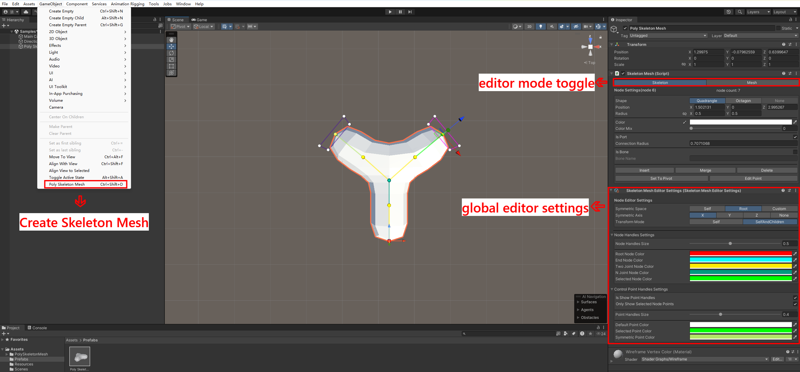

### Creating Skeleton Mesh

A new skeleton mesh can be created through the menu `GameObject` -> `Poly Skeleton Mesh`. You can also create a new skeleton mesh by using the keyboard shortcut `Ctrl+Shift+D`. When in the skeleton editing mode, the newly created mesh will be generated based on the position and radius of the currently selected node.

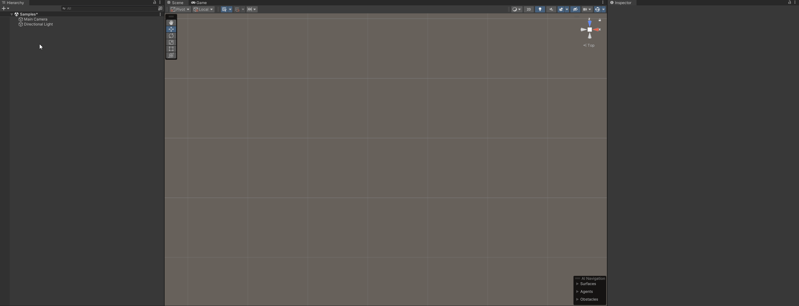

### Creating New Node

Ensure the scene `Tools` is set to `Move Tool`. Select a node in the scene, hold down the `Shift` key on the keyboard, and drag the `Position` control in the scene to create a new node. You can switch the symmetry center, symmetry axis, and other settings through `Node Editor Settings`.

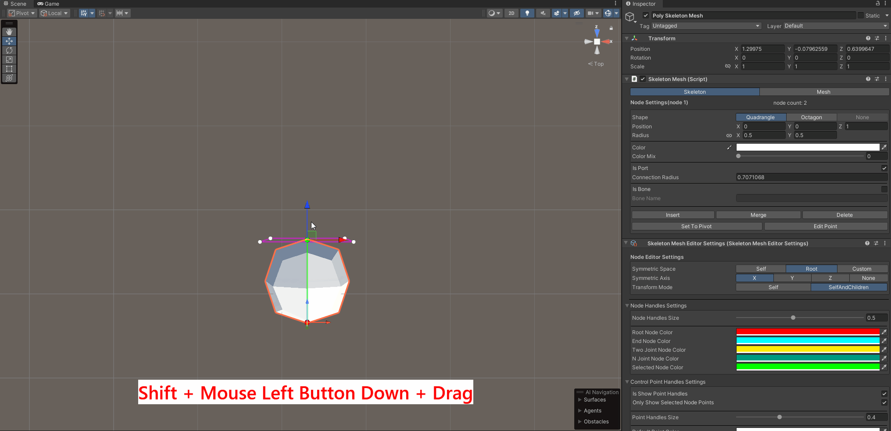

### Editing Node

In the scene, select one node, hold down the `Ctrl` key on the keyboard, and select another node in the scene to change the parent-child relationship between nodes.

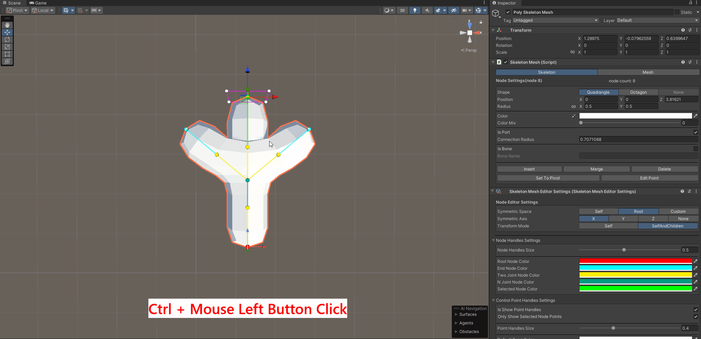

Switching scene `Tools` allows operations like `Move`, `Rotate`, `Scale` on nodes. Switching the `Transform Mode` configuration item in `Node Editor Settings` allows you to choose to edit only the current node or the current node and all its child nodes.

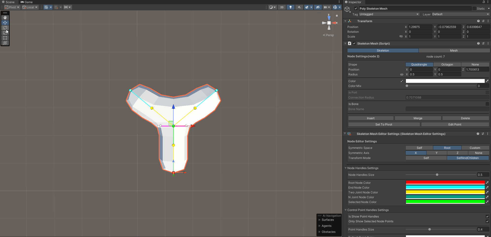

Adjusting the node configuration items in the `Inspector` allows more precise settings for node shape, position, radius, color, etc.

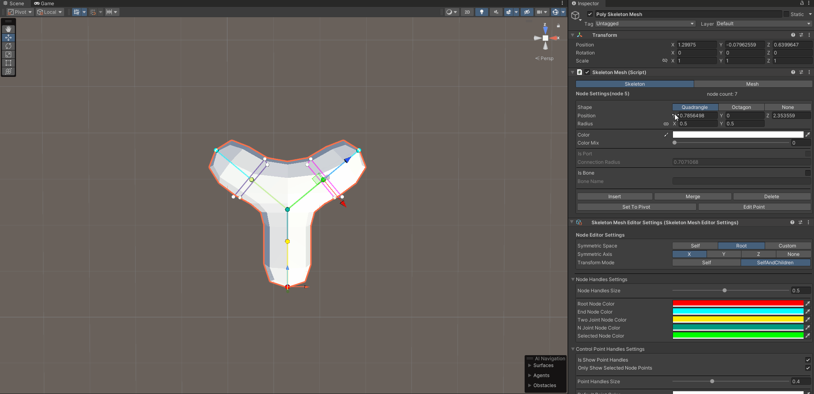

### Editing Control Points

In addition to editing nodes, you can also edit the control points of each node, which allows for more detailed control of the node shape.
Hold down the `Ctrl` key on the keyboard to select multiple control points for editing.

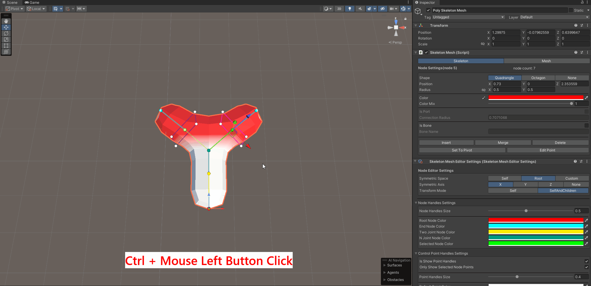

### Color Brush

You can use the color brush to change the color of the selected node or selected control point. Click the color brush icon in the `Node Editor Settings` to activate the color brush. Then, you can click on the nodes or control points in the scene to change their colors. Finally, you can click the `Mouse Right Button` to cancel the color brush.

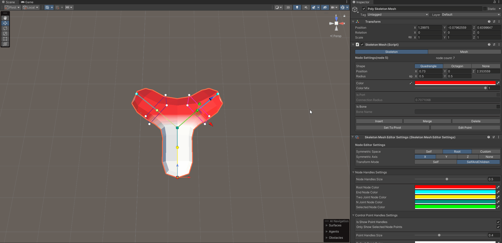

### Splicing Skeleton Meshes

After editing the skeleton, you can save the current skeleton mesh as a prefab. Switch to the mesh configuration item in the `Inspector`, select a skeleton mesh in the scene as the base, drag the skeleton mesh prefab to be spliced into the scene, and move it to select the nearest splicing port to perform splicing. During splicing, click the `Ctrl` key on the keyboard to change the port to be spliced, and hold down the `Alt` key on the keyboard to rotate the prefab.

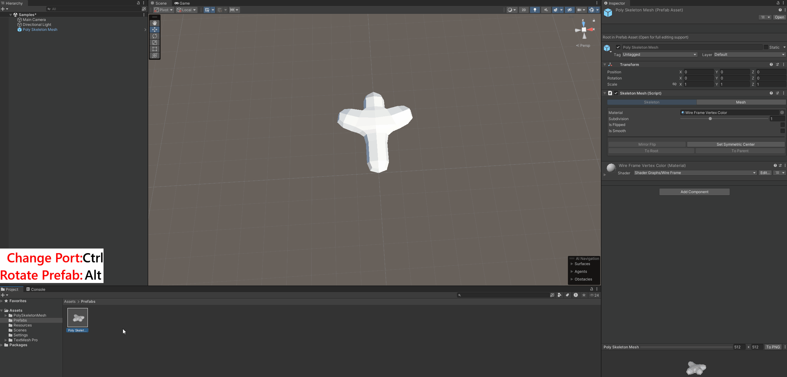

### Export

The edited mesh supports exporting as a prefab, and you can choose whether to automatically generate bone binding.

<video class="img-responsive" autoplay loop muted playsinline  height="700" src="images/document/skeleton%20mesh%20export.mp4">Your browser does not support the video tag.</video>

## Runtime

This tool provides runtime support and can dynamically create skeleton meshes through code.

```csharp
    [RequireComponent(typeof(SkeletonMesh))]
    public class SampleSkeletonMesh : MonoBehaviour
    {
        private SkeletonMesh _skeletonMesh;

        private void Awake()
        {
            _skeletonMesh = GetComponent<SkeletonMesh>();
        }

        private void Start()
        {
            var node1 = _skeletonMesh.RootNode.AddChild(Vector3.forward);
            var node2 = node1.AddChild(new Vector3(1, 0, 1), 1f);
            var node3 = node2.AddChild(new Vector3(1, 0, 2), 1f);
        }
    }
```

The above code can create a mesh as shown in the image below:

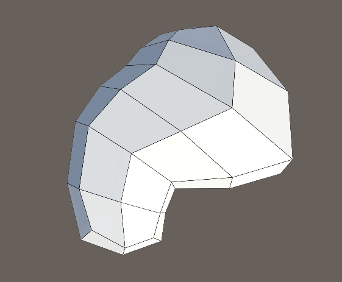

## Samples

### Tree Generator

A simple tree generator that automatically generates low-polygon tree models by adjusting the corresponding parameters. The entire tree is generated by single `SkeletonMesh` component.

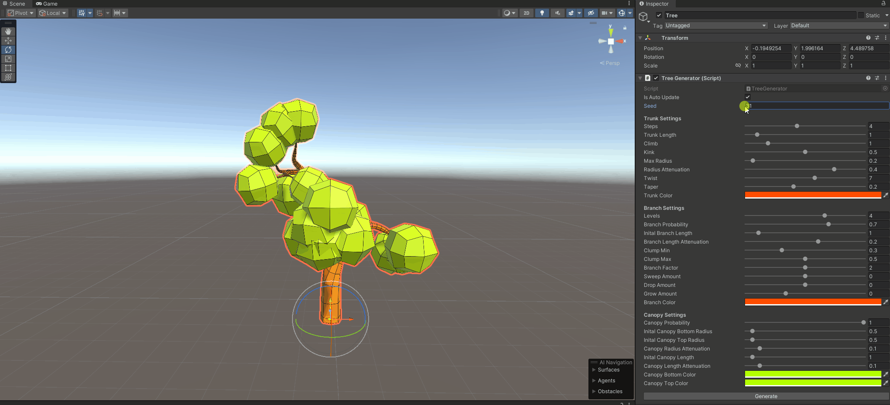

### Wireframe Mesh Generator

A simple wireframe mesh generator that can generate a skeleton mesh model of the connection of mesh vertices and edges based on the existing mesh, and each vertex of the mesh generates a `SkeletonMesh` component.

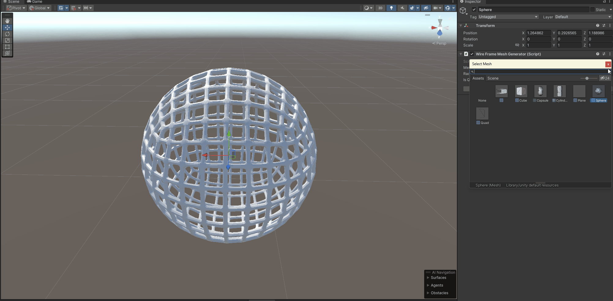

### Monster Simulator (Runtime)

A simple monster simulator that creates different monster models by piecing together different body parts. At the same time, it automatically generates bone binding and adds simple procedural animations. 

<font color="red">`Note`: this example uses the old input system.</font>

<video class="img-responsive" autoplay loop muted playsinline  height="700" src="images/document/monster%20generator.mp4">Your browser does not support the video tag.</video>

The generated monsters can be archived in `json` format. 

<video class="img-responsive" autoplay loop muted playsinline  height="700" src="images/document/monster%20save%20data.mp4">Your browser does not support the video tag.</video>
